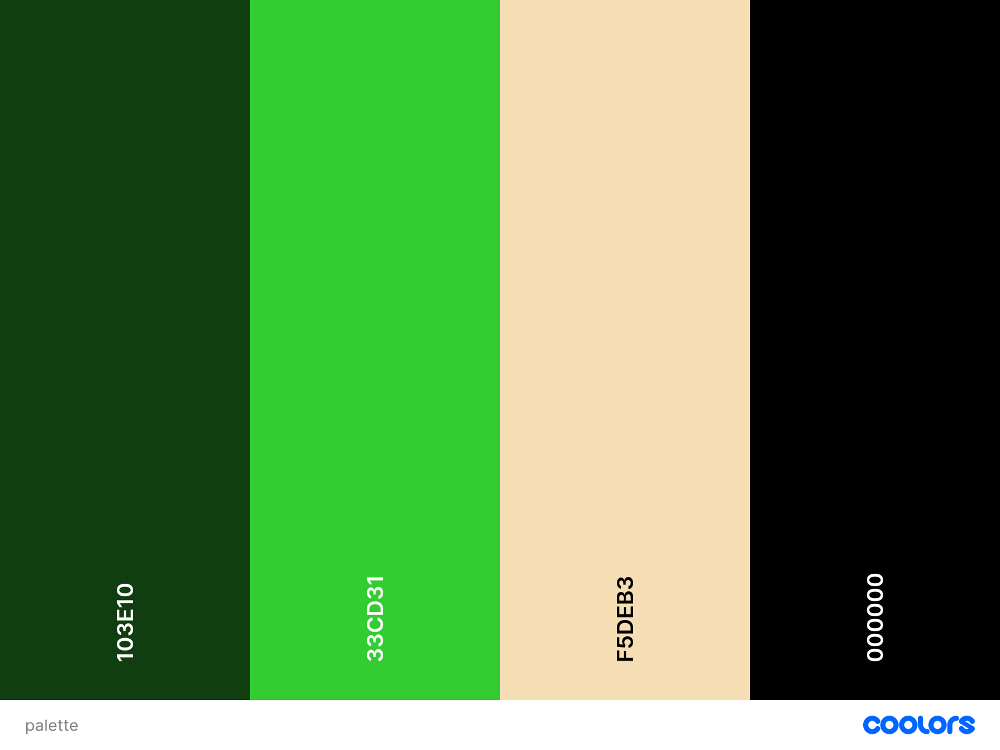
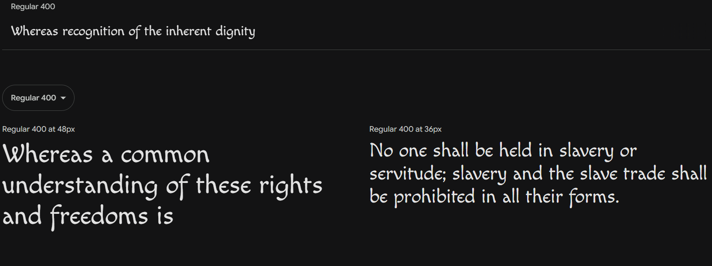
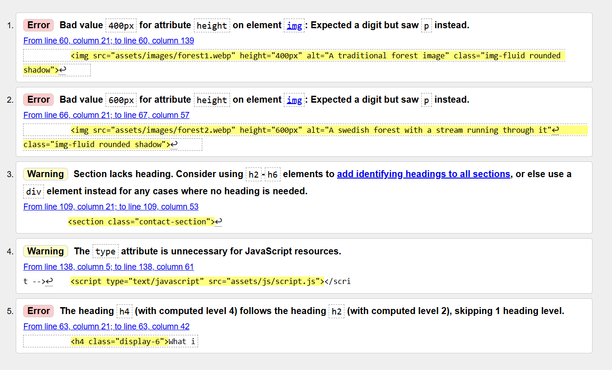
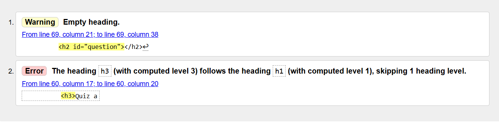
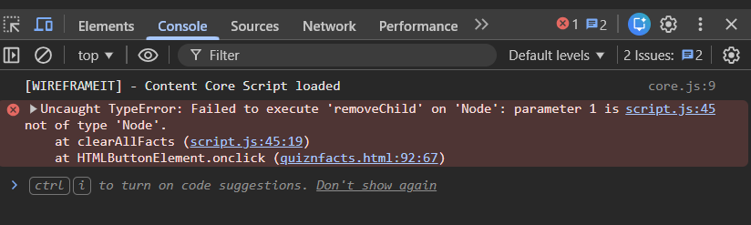
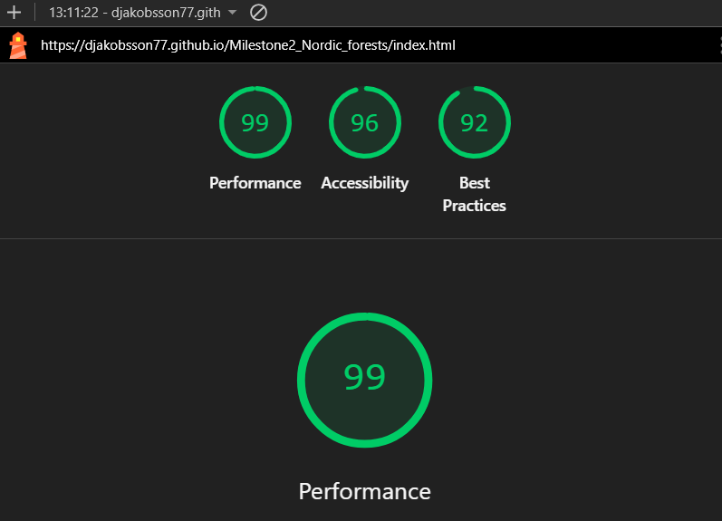
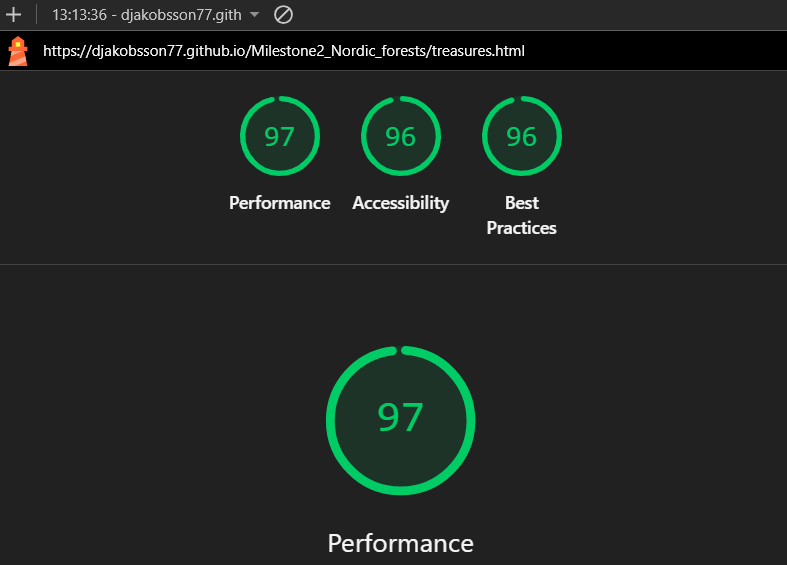
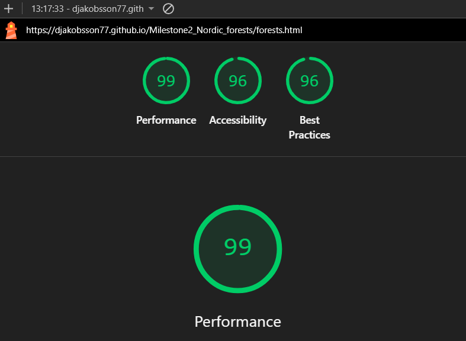
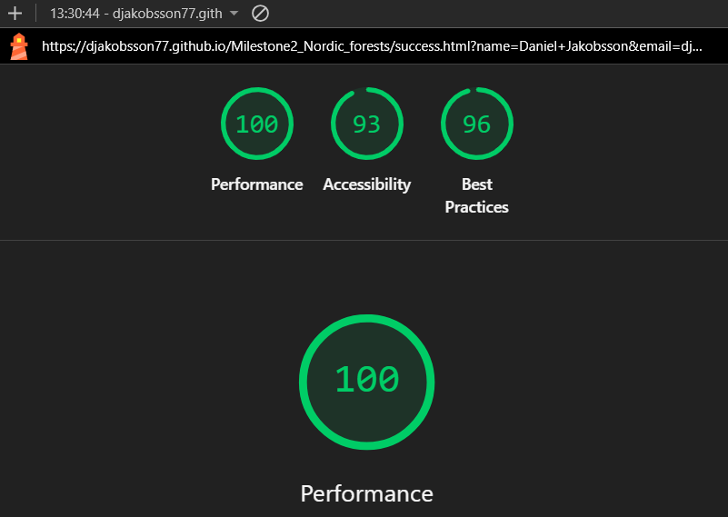

# The Nordic Treeasures Website

The Nordic Treeasures Website is a responsive website allowing visitors to view on a range of devices. Visitors can here read about the nordic nature (Primary in Sweden), about berries, mushrooms and forests. There is also an interactive quiz and facts page where users can interact with several buttons.

## Contents
 
* [User Experience (UX)](#user-experience-ux)
  * [Project Goals](#project-goals)
  * [User Stories](#user-stories)

* [Design](#design)
  * [Color Scheme](#color-scheme)
  * [Typography](#typography)
  * [Imagery](#imagery)

* [Features](#features)
  * [General Features on Each Page](#general-features-on-each-page)
  * [Future Implementations](#future-implementations)
  * [Accessibility](#accessibility)

* [Technologies Used](#technologies-used)
  * [Languages Used](#languages-used)
  * [Frameworks, Libraries & Programs Used](#frameworks-libraries--programs-used)

* [Deployment & Local Development](#deployment--local-development)
  * [Deployment](#deployment)
  * [Local Development](#local-development)
    * [How to Fork](#how-to-fork)
    * [How to Clone](#how-to-clone)

* [Testing](#testing)

* [Credits](#credits)
  * [Code Used](#code-used)
  * [Content](#content)
  * [Media](#media)
  * [Acknowledgments](#acknowledgments)

## User Experience (UX)

### Project Goals

The main goal with this project is to show what the nordic forests can offer when it comes to berries and mushrooms that grows within the deep forests.

### User Stories

#### Client Goals
 * To make the website responsive on multiple device sizes
 * To make it easy for users to find information about what the treasures is throughout the nordic nature.
 * To make the website simple and clean so it will be easy for visitors to find what they are looking for.
 * To have some interactive features where users can have fun and interact with the page by clicking buttons and answer questions in a quiz.

#### First Time Visitor Goals
 * I want to find out what the nordic treasures are.
 * I want to know more about the nordic nature.

#### Returning Visitor Goals
 * I want to review the forest hotspots to visit.
 * I want to contact the author with questions I might have

## Design

### Color Scheme
Colors were carefully picked to suit the webpage theme: 
Lime green (#33CD31) for the navbar. 
Black forest (#103E10) for the body background. 
Wheat (#F5DEB3) for the text. 
Black (#000000) for the contact form background. 
Some other colors were choosed for the buttons but it doesn't change the overall color consistency of the webpage. 

### Typography
Google fonts were used and I choosed the Macondo font which is a stylized calligraphic font.
Suitable for the webpage and inspires the viewer to think about ancient forests.

### Imagery
All the images on the site is chosen from Pinterest website.

## Features
The website consists of 5 pages, the index page, a treasures page, a forests page, a quiznfacts page and a success page.

The index page is the main page and has a navbar, a section with a introducing text along with 2 images of the nordic nature, a footer with a contact form.

The treasures page has the navbar, 6 images of berries and 4 images of mushrooms along with some information about each one of them. At the bottom is the contact form available.

The forests page has the navbar, shows 5 different hotspots in Sweden to visit and information about what you can find on each place and at bottom is the contact form. 

The quiznfacts page has the navbar, a quiz with 10 questions, and 5 facts about berries, mushrooms, trees and forests.

The success page comes up when the user sends a correctly filled contact form in the footer. It notify the user that the message has been sent successfully.

### General features on Each Page
All pages have:
 1. A navbar which helps the visitor to navigate around the website.
 2. A contact form so visitors easily can get in contact with me.

### Future Implementations
* As I learn more and more about JavaScript, more interactive functions can be included on the website

### Accessibility
I have had much thoughts about how to make the website accessible friendly. I have achieved this by:
* Using semantic HTML
* All images on the website has a descriptive alt attribute
* Given the colors enough contrast to be easily seen on all pages.

## Technologies Used

### Languages Used
HTML, CSS and JavaScript

### Frameworks, Libraries & Programs Used
Bootstrap - For responsiveness and for some styling

Coolors and Imagecolorpicker - A combination of these to choose the colors on the website.

Google fonts - for choosing the font used throughout the website.

Git - For version control

Github - To store the files for the website

Tiny PNG and Birme - Combinated to compress and convert the images to webp.

Google Dev Tools - To test functions and troubleshoot issues with responsiveness.

## Deployment & Local Development

### Deployment

The website is deployed using Github.
You can visit it [here.](https://djakobsson77.github.io/Milestone2_Nordic_forests/index.html)

To Deploy the site using GitHub Pages:

1. Login (or signup) to Github.
2. Go to the repository for this project, [djakobsson77/Milestone2-Nordic_forests](https://github.com/djakobsson77/Milestone2_Nordic_forests.git)
3. Click the settings button.
4. Select pages in the left hand navigation menu.
5. From the source dropdown select main branch and press save.
6. The site has now been deployed, please note that this process may take a few minutes before the site goes live.

### Local Development

#### How to Fork

To fork the repository:

1. Log in (or sign up) to Github.
2. Go to the repository for this project, [djakobsson77/Milestone2-Nordic_forests](https://github.com/djakobsson77/Milestone2_Nordic_forests.git)
3. Click the Fork button in the top right corner.

#### How to Clone

To clone the repository:

1. Log in (or sign up) to GitHub.
2. Go to the repository for this project, [djakobsson77/Milestone2-Nordic_forests](https://github.com/djakobsson77/Milestone2_Nordic_forests.git)
3. Click on the code button, select whether you would like to clone with HTTPS, SSH or GitHub CLI and copy the link shown.
4. Open the terminal in your code editor and change the current working directory to the location you want to use for the cloned directory.
5. Type 'git clone' into the terminal and then paste the link you copied in step 3. Press enter.

## Testing
I have manually tested the website on three devices:
* Smart phone: Samsung Galaxy A51
* Tablet: Samsung Galaxy Tab A 10.1
* Desktop: MSI GF63 Thin i5-12H 15.6"  
And with the Google Chrome browser and Microsoft Edge browser.

| feature | action | expected result | tested | passed | comments |
| --- | --- | --- | --- | --- | --- |
| Navbar | | | | | |
| Home | Click on the "Home" link | The user is redirected to the main page | Yes | Yes | - |
| The Treasures | Click on "The Treasures" link | The user is redirected to the treasures page | Yes | Yes | - |
| Forests | Click on the "Forests" link | The user is redirected to the forests page | Yes | Yes | - |
| Quiz'n'Facts | Click on the "Quiz'n'Facts" link | The user is redirected to the quiznfacts page | Yes | Yes | - |
| Contact | Click on the "Contact" link | The user is redirected to the contact section at bottom of the webpage | Yes | Yes | - |
| Home page | | | | | |
| The Treasures page | | | | | |
| Forests page | | | | | |
| Quiz'n'Facts page | Click the buttons in the quiz, the new fact button and reset facts button| All the buttons in the quiz and facts works as intended | Yes | Yes | |
| Contact form in the footer | Name input:  Enter the name | The name is entered | Yes | Yes | If user doesn't enter the name, the error message appears |  
| | Email input: Enter the email | The email is entered | Yes | Yes | If user doesn't enter the email, the error message appears. If user enters not valid email, the error message appears |
| | Message input: Enter a message | Message is entered | Yes | Yes | If user doesn't enter the email, the error message appears. If user enters not valid email, the error message appears |
| "SEND" button | Click on the "SEND" button | The user is redirected to a success page and is notified about message sent successfully | Yes | Yes | - |
| Success page | Click on the Return to home page | The user is redirected to the main page | Yes | Yes | - |

I have used [W3C Markup Validator](https://validator.w3.org/) and [W3C CSS Validator](https://jigsaw.w3.org/css-validator/) for validate the html and the CSS. I used the console in devtools to debug the javascript file.

* The index.html had 5 issues.

Issue 1 and 2 was fixed by deleting the px after the numeric value.
Issue 3 was fixed by using a div instead of a section.
Issue 4 was fixed by deleting the type attribute in the script tag.
Finally issue 5 was solved by deleting the bootstrap class.
After this I made the same changes for issue 3, 4 and 5 to all the html files since they all had the same fault.

* The quiznfacts.html had 2 issues.

  Issue 1 fixed by adding a character to the empty space. I checked so that the character didn't appear throughout the quiz. 
  Issue 2 fixed by changing the h3 heading to a h2 heading instead.

* The forests.html had no errors or warnings.

* The treasures.html had no errors or warnings.

* The success.html had no errors or warnings.

* The style.css had no errors or warnings.

* The script.js had one error

The devtools console returned one error which was solved by deleting the if statement containing the removeChild method

I used [Autoprefixer CSS Online](https://autoprefixer.github.io/) for putting prefixes to the CSS so it will work on all browsers.

I used Lighthouse in Google Dev Tools to see the performance. The report displayed good values on all html files so I let it stay. 

## Credits

### Code Used

### Content

All content is written by me, Daniel Jacobsson, the author of the website.

### Media

All images was found on [Pinterest](https://www.pinterest.com).

### Acknowledgments
I took a little help of the Co-Pilot AI to code the last bit of the quiz in JavaScript but I carefully inspected and studied the code after to fully understand the outcome.